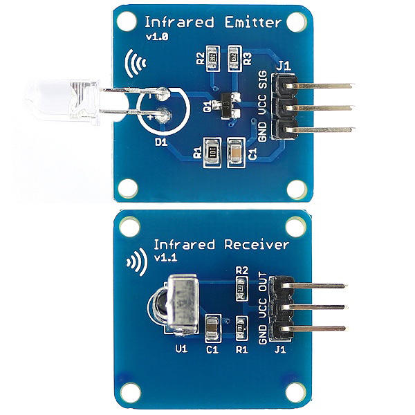
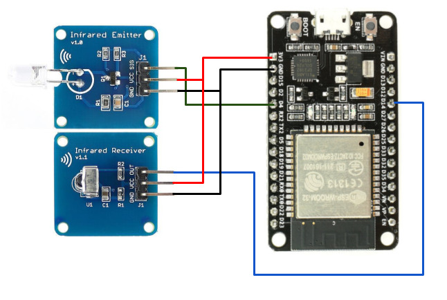

# ESP32 MQTT IR Remote

A simplest remote IR application that can turn on your aircon (or other devices) via MQTT message.

## How To

Let's break the whole system into several parts so you can understand each segment clearly.

### Learn Signals

This MQTT IR Remote thing needs to learn the IR signal that comes from the remote control unit of the specific aircon model. For this purpose, I used an Infrared Receiver as hardware and used the sketch `IRremoteESP8266/Examples/IRrecvDemo.ino`. Burn this sketch and open serial console. The program will wait for signals through its IR receiver. Just press the ON button of your aircon remote control and point it to the receiver. You are supposed to see some raw data printed on the serial console. Just copy the stream for future use.

### Send Signals

IR signals can be sent easily via `IRremoveESP8266` library. They have a class named `IRsend`. You can bind this with any GPIO pin and send signals. But wait! Don't loose hope when your aircon does not respond for the command sent by your program. The reason could be the IR transmitter uses 3.3V which makes the IR signal less powerful to reach the aircon's sensor.

### Send Signals on MQTT Messages

The logic is simple. Your program should connect to a broker, wait for payload on a certain topic, when received send a signal to the IR transmitter.

## ✨ Hardwares

[Mini-38KHz-IR-Infrared-Transmitter-Module-IR-Infrared-Receiver-Sensor-Module](https://sea.banggood.com/Mini-38KHz-IR-Infrared-Transmitter-Module-IR-Infrared-Receiver-Sensor-Module-For-Arduino-RPI-STM32-p-1066428.html)

[ESP32-Development-Board](https://sea.banggood.com/ESP32-Development-Board-WiFibluetooth-Ultra-Low-Power-Consumption-Dual-Cores-ESP-32-ESP-32S-Board-p-1109512.html)

## Dependencies

[IRremoteESP8266](https://github.com/markszabo/IRremoteESP8266.git) - Send and receive infrared signals with multiple protocols (ESP8266)
[EspMQTTClient](https://github.com/plapointe6/EspMQTTClient) - A library that provides a wifi and MQTT connection to an ESP8266/ESP32
[PubSubClient](https://github.com/knolleary/pubsubclient.git) - A MQTT 3.1.1 supported client library for Intel Galileo/Edison, ESP8266 and TI CC3000

## Diagram

## Support

Please ⭐️ this repository if this project helped you!

## WTFPL

This project is [WTFPL](http://www.wtfpl.net/) licensed.
